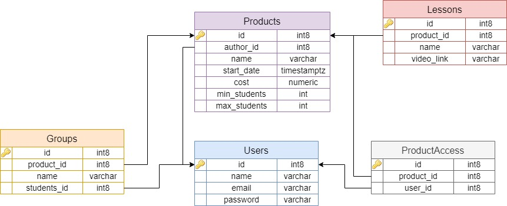

# Тестовое задание Backend/Django

### Построение архитектуры

1. Создан модель Product с полями: author, name, start_date, cost, min_students и max_students
2. Для определения доступа пользователя к продукту, создан модель ProductAccess с полями user и product. Это позволит нам связать пользователя с продуктом, к которому он имеет доступ.
3. Создан модель Lesson с полями: product , name и video_link
4. Создан модель Group с полями: product , name и students

### Схема таблиц база данных
